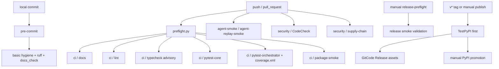

# CI/CD 环节与检查内容

本文说明 F-73 当前 CI/CD 由哪些环节组成、每个环节检查什么、失败时应优先看
哪里。

## 总览

`scripts/ci/local_ci.py` 会在本地按同一形状执行可复现的门禁。默认范围是当前
HEAD commit 的已提交内容，不纳入当前工作树中未提交或未跟踪的文件。需要模拟
PR/push 时使用 `--base <ref>`；需要排查历史债时再显式使用 `--all`。它会把
GitCode CodeCheck、TestPyPI/PyPI 上传、GitCode Release 上传标记为 remote-only
或 destructive skip。

在交互式终端中，`local_ci.py` 使用 Rich live dashboard：总流程表常驻显示，
当前步骤以运行中状态高亮，完成后显示通过、跳过、advisory 或失败；下面的详情面板
显示当前步骤命令和失败原因。非交互式日志自动回退为纯文本。

## 本地 pre-commit

触发方式：开发者执行 `python -m pre_commit install` 后，普通 `git commit`
自动触发；也可以手动跑 `python -m pre_commit run --all-files`。

检查内容：

- YAML/TOML 基础语法。
- 文件最终换行、尾随空白、合并冲突标记。
- 私钥检测。
- ruff lint 与 ruff format。
- 轻量文档检查。

定位：这是提交前早期检查，不替代 GitCode 的 push/pull_request 门禁。

## `preflight`环节

触发方式：`ci.yml`、`agent-smoke.yml` 和本地 `local_ci.py` 都会先运行。

检查内容：

- 计算相对目标分支的变更文件，或在 `--all` 模式下读取全部 tracked 文件。
- 写出 `CI_RUN_DOCS`、`CI_RUN_PYTHON`、`CI_RUN_ORCHESTRATOR`、`CI_RUN_PACKAGE`、
  `CI_DOCS_ONLY` 等布尔值。
- 写出 Python 文件清单和 docs 文件清单，避免 workflow 用 shell 字符串拼接
  文件路径。
- 如果 diff 范围无法可靠计算，回退到 tracked 文件，避免误跳过检查。

失败含义：通常是 Git 基线不可解析、工作区不是仓库或本地 remote/ref 不存在。
本地建议直接用 `local_ci.py` 检查当前 commit；只有排查历史债时再显式加 `--all`。

## `ci / docs`

触发方式：存在 Markdown、MDX、RST 或 `docs/` 范围变更时运行。

检查内容：

- UTF-8 解码。
- 尾随空白。
- 文件最终换行。
- 明确的 merge conflict marker。
- 本地相对链接是否指向存在的仓库内文件。

## `ci / lint`

触发方式：Python 文件、包配置、CI helper 或运行时包范围变更时运行。

检查内容：

- `ruff check`。
- `ruff format --check`。
- 有变更 Python 文件时只检查这些文件；只有包配置或 CI 配置变更时回退检查全仓。

失败含义：新增或受影响 Python 文件存在语法/未定义名等高信号问题，或格式没有
通过 ruff。

## `ci / typecheck`

触发方式：当前 workflow 每次运行都会执行。

检查内容：

- `python -m mypy src clawcodex_ext extensions`。

当前策略：

- 该门禁是 advisory，不阻塞合入。
- 已知基线会在模块发现阶段失败，例如 `clawcodex_ext.command_system.__init__`
  被当成 package 与子模块重复发现。

后续目标：先修复 duplicate module discovery 和 lazy proxy 迁移遗留问题，再移除
workflow 中的 `|| true`，把它提升为阻塞门禁。

## `ci / pytest-core`

触发方式：Python、包或 CI 变更时运行。

检查内容：

- `tests/fast`。
- config、model、input、permissions、hooks、skills、bridge 等稳定核心 smoke。
- `tests/ci/test_gitcode_release.py`，固定 GitCode Release 预签名上传契约。
- 运行前清空 live provider key，避免误打真实模型。

定位：这是当前可阻塞的核心测试子集，不等于全量 pytest。

## `ci / pytest-orchestrator`

触发方式：orchestrator、包或 CI 变更时运行。

检查内容：

- orchestrator local tracker 和 F-39 intent smoke。
- visualizer/orchestrator link smoke。
- `pytest-cov` 对 `extensions.orchestrator`、`clawcodex_ext`、`src` 输出终端报告
  和 `coverage.xml`。
- `--cov-fail-under=0`，覆盖率只报告不阻塞。

定位：给 orchestrator 关键路径保留可见覆盖率，同时避免当前历史测试债把合入卡死。

## `ci / package-smoke`

触发方式：非 docs-only 变更时运行；docs-only 变更由 preflight 写出的
`CI_RUN_PACKAGE=false` 跳过。`ci.yml` 和本地 `local_ci.py` 使用同一判定。

检查内容：

- 清理 `dist/`、`build/`。
- `python -m build`。
- `python -m twine check dist/*`。
- 在干净虚拟环境安装生成的 wheel。
- 运行 `clawcodex-dev --help`。

失败含义：包元数据、MANIFEST、entry point、依赖声明或 wheel 安装路径有问题。

## `agent-smoke / agent-replay-smoke`

触发方式：非 docs-only 变更时运行。

检查内容：

- mock LLM 文本响应进入当前 query/agent loop。
- mock LLM 返回 `Write` tool_use 后真实执行工具并写入临时文件。
- `dontAsk` 权限拒绝路径不写文件但返回可诊断 tool_result。
- transcript 回放。
- resume/session 恢复。
- workspace hook 行为。

暂不支持检查的内容：

- 真实 provider API 调用质量。
- live-agent E2E。

## `security / supply-chain`

触发方式：push、pull request、workflow_dispatch；本地由 `local_ci.py` 或
`supply_chain_audit.py` 执行。

检查内容：

- 私钥块。
- 高信号 token/secret 赋值。
- base64 decode 加 exec/eval。
- 混淆 subprocess/os.system 模式。
- `.pth` 安装时执行风险。
- `setup.py`、`setup.cfg`、`pyproject.toml` 中高风险安装 hook。

扫描策略：

- 默认扫描 diff 新增行。
- `--all` 或 diff 不可用时扫描 tracked 文件。
- 跳过 generated/vendor/demo/patches 等高噪声路径。

## `security / CodeCheck`

触发方式：GitCode 远端 `security.yml` 中的 `codecheck-action@0.0.3`。

检查内容：

- GitCode 原生 CodeCheck，当前配置 `PYTHON,SHELL` rule sets。

当前限制：

- 本地不能等价复现。
- 需要 GitCode Pipeline 和 `GITCODE_TOKEN`。
- 在当前仓库 Pipeline 能力不可用时，文档和 `local_ci.py` 都把它标记为远端待验证项。

## `release-preflight`

触发方式：维护者手动触发，目标是发布候选 ref/tag/commit。

检查内容：

- CI helper 范围的 ruff check 和 ruff format check。
- mypy advisory。
- 稳定 pytest smoke，包含 core、agent-smoke、orchestrator 和 GitCode Release 上传契约。
- 覆盖率报告。
- build、twine check、wheel 安装、`clawcodex-dev --help`。

## `publish`

触发方式：`v*` tag push 或维护者手动 dispatch。

检查内容与动作：

- 校验 release tag 已存在。
- 如果当前 checkout 不在 tag commit，切到 tag commit。
- 重新运行发布 smoke。
- 构建并检查 dist。
- 默认发布到 TestPyPI。
- 创建或更新 GitCode Release，上传 wheel、sdist、`SHA256SUMS`。
- 只有维护者确认后，才用 `PYPI_TOKEN` 晋升生产 PyPI。

当前限制：

- GitCode Pipeline 不可用时，真实远端 publish 无法在仓库里跑。
- 本地 fallback 是 `scripts/ci/local_publish.py`，但非 `--dry-run` 会改动外部服务。
